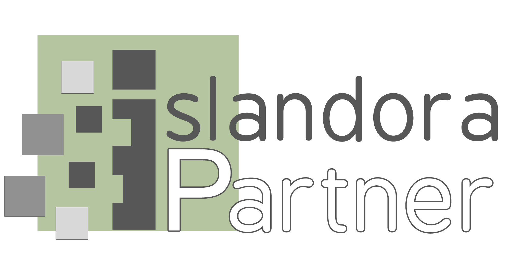

# Islandora Collaboration Group

## Mission Statement
The Islandora Collaboration Group (ICG) is an inclusive community of practice committed to helping our members make Islandora a sustainable long-term solution for the preservation and access of a wide array of cultural heritage and scholarly materials.

## About Us
The Islandora Collaboration Group (ICG), founded in 2012, is a consortium of primarily liberal arts colleges collaborating to support and extend the Islandora digital repository through direct development, resource pooling, and advocacy. The ICG holds monthly steering committee meetings to develop strategy and organization and plan progress. The ICG has a [Code of Conduct](https://github.com/Islandora-Collaboration-Group/icg_information/blob/master/code-of-conduct.md), has created the *Islandora for All* [ISLE](https://github.com/Islandora-Collaboration-Group/ISLE) and [LASIR](https://github.com/Islandora-Collaboration-Group/LASIR) projects, holds friendly hack/doc meetings twice a year for code and documentation development (open to all members), and is developing an annual summit meeting. General communication and meeting announcements happen via the islandora-consortium-group@googlegroups.com mailing list.

## Members
* Amherst College
* [Barnard College](http://digitalcollections.barnard.edu)
* [Colgate University](https://digitalcollections.colgate.edu/)
* [Five College Compass: Digital Collections](https://compass.fivecolleges.edu/)
  * [Hampshire College](https://compass.fivecolleges.edu/institution/hampshire-college)
  * [Mount Holyoke College](https://compass.fivecolleges.edu/institution/mount-holyoke-college)
  * [Smith College](https://compass.fivecolleges.edu/institution/smith-college)
* [Franklin & Marshall College](https://digital.fandm.edu/)
* [Grinnell College](https://digital.grinnell.edu/)
* [Hamilton College](http://www.dhinitiative.org)
* Rensselaer Polytechnic Institute
* Tri-College Libraries Consortium
  * Bryn Mawr College
  * Haverford College
  * Swarthmore College
* [Vassar College](https://digitallibrary.vassar.edu)
* [Wesleyan University](https://digitalcollections.wesleyan.edu/)
* [Whitman College](https://arminda.whitman.edu)
* [Williams College](https://unbound.williams.edu)

## Highlighted ICG Projects
* *Islandora for All*
  * [ISLE - Islandora Enterprise](https://github.com/Islandora-Collaboration-Group/ISLE)
  * [LASIR - Liberal Arts Sprint for Institutional Repositories](https://github.com/Islandora-Collaboration-Group/LASIR)
* [Islandora Sample Objects](https://github.com/Islandora-Collaboration-Group/islandora-sample-objects)
* [ICG Islandora Webform module](https://github.com/Islandora-Collaboration-Group/islandora_webform)
* [ICG Drush Sitespinner](https://github.com/Islandora-Collaboration-Group/drush-sitespinner)
* [ICG Islandora Unit Tests](https://github.com/Islandora-Collaboration-Group/icg_islandora_unit_tests)

## ICG Conference Presentations @ Islandora
* Upcoming - [Islandora for All: ISLE Workshop](https://islandora.ca/camps/islandoracon2019) Islandoracon 2019, October 7 in Vancouver, British Columbia, Canada
* OPEN REPOSITORIES 2019, June 10 in Hamburg, Germany
  * [Islandora for All: Community Sustainability and Lessons Learned](https://or2019.blogs.uni-hamburg.de/) 
  * [Islandora for All: ISLE Workshop](https://or2019.blogs.uni-hamburg.de/)
* Hack/Doc @ Rensselaer Polytechnic Institute (RPI) on May 23-24, 2019
* [Islandora for All: ISLE Workshop](https://nercomp.org/forms/meeting/Microsite/Islandora) NERCOMP, May 22, 2019 at Union College in Schenectady, NY
* NECode4lib Spring 2019 at Smith College (regional conference), Northampton, MA, United States
  * [Islandora for All: ISLE Workshop](https://wiki.code4lib.org/NECode4lib_Spring_2019), ([workshop slides](https://drive.google.com/file/d/1jbee3uHL1BUwT6Et2vQ9PPZpC3XmqV_n/view?usp=sharing))
* 2019 Code4Lib (annual conference), San José, CA
  * [Islandora for All: ISLE Workshop](https://2019.code4lib.org/workshops/ISLE-Islandora-for-All), ([slides: 3-hour workshop](https://osf.io/w3hnv/))
  * [Poster Session: Earnest if Not Agile: Community ownership of open source software solutions](https://2019.code4lib.org/posters/Earnest-if-Not-Agile-Community-ownership-of-open-source-software-solutions), ([poster](https://osf.io/nbwc6/))
  * [Lightning Talk: Islandora for All](https://wiki.code4lib.org/Code4Lib2019_Lightning_Talks), ([slides](https://osf.io/fby9s/)), ([YouTube](https://youtu.be/uXYIjJrfqnI?t=70))
  * [Breakout Session: Islandora](https://wiki.code4lib.org/Code4Lib2019_Breakout_Sessions)
* 2018 CNI (annual conference), Washington, DC
  * [Centering the community in liberal arts open source: reports on work of the Islandora Collaboration Group and the Five College Consortium](https://www.cni.org/topics/economic-models/centering-the-community-in-liberal-arts-open-source-reports-on-work-of-the-islandora-collaboration-group-and-the-five-college-consortium), ([slides](https://osf.io/rka78/))
* 2018 DLF (annual conference), Las Vegas, NV
  * ["Islandora for All: Adding Digital Scholarship Tools and IR Experience with LASIR Phase II"](https://dlfforum2018.sched.com/event/FVCs/t6d-platform-updates) ([slides](https://osf.io/dbjzw/))
* 2018 Code4Lib preconference (annual conference), Washington, DC
  * ["ISLE: Islandora Installation Simplified"](https://2018.code4lib.org/workshops/isle-islandora-installation-simplified) ([3-hour presentation](https://drive.google.com/file/d/1mmQh4ZxsQGgEgPwP46MsY8RX4I0fRb9j/view?usp=sharing) + [hands-on workshop](https://drive.google.com/file/d/1zpB5PyEV-PHkV-OmU9FbNjlwCpLRkre2/view?usp=sharing))
* 2017 DLF (annual conference), Pittsburgh, PA
  * ["Islandora: Community and Collections"](https://dlfforum2017.sched.com/event/Bzsu/t5b-islandora-community-and-collections) (panel of 7 institutions, [ISLE Facebook video](https://www.facebook.com/archivists.atbarnard/videos/vb.100000636466830/1785595161471682/?type=2&theater), [slides](https://osf.io/2xrpq/))
  * ["Hack/Doc Partnerships for Library Technology Projects"](https://dlfforum2017.sched.com/event/Bzsr/t4c-working-lunch-hackdoc-partnerships-for-library-technology-projects) ([slides](https://drive.google.com/file/d/1OySkajwr8dyW_4-XDMrRjcbabIvNYSe2/view?usp=sharing), [hack/doc templates](https://github.com/Islandora-Collaboration-Group/icg_information/tree/master/templates_how_to_run_a_hack_doc))
* 2017 Islandoracon (biennial conference), Hamilton, Ontario, Canada
  * ["Islandora Enterprise (ISLE) MVP"](https://docs.google.com/presentation/d/1wj95Dxu4iVt98rahj3QEp73xLFlsAmr_lrjhbzU2jCQ/edit?usp=sharing) (full plenary, [ISLE demo](https://www.youtube.com/watch?v=F30M-x-O1kM), [ISLE brochure](https://drive.google.com/file/d/0BwWnQmDKeQGBUXg2RTFXdFZuUmM/view?usp=sharing))
  * ["Hack/Doc Partnerships for Islandora Projects"](https://docs.google.com/presentation/d/1s0foVJVtNUVb1HJWPhZitHPwzoLfY5fxYCAejLtNAhI/edit?usp=sharing) (full plenary)
  * ["Islandora for Consortia"](https://drive.google.com/file/d/1Y46EEhAm_eYfmSHY_uYs3kcSpEFNJ88k/view?usp=sharing) (workshop)
* 2017 NERCOMP (annual conference), Providence, RI
  * ["Hack/Doc Partnerships for Organizational Projects"](https://events.educause.edu/nercomp-annual-conference/2017/agenda/hackdoc-partnerships-for-organizational-projects) (workshop)
* 2016 DLF LAC (pre-conference), Milwaukee, WI
  * ["Hack/Doc Partnerships for Library Projects"](https://dlfforum2016.sched.org/event/8LFu/s4c-hackdoc-partnerships-for-library-projects) (workshop)
* 2016 Oberlin Digital Scholarship Conference, St. Paul, MN
  * ["Making Islandora work at the LAC-level"](https://www.macalester.edu/library/oberlindsconference/schedule.html#) (workshop)
* 2015 Islandoracon (biennial conference), Charlottetown, PEI, Canada
    * ["An Islandora Odyssey: The Liberal Arts Journey with Islandora (so far)"](https://islandora.ca/camps/conference2015/schedule) (workshop)
* 2013 Open Repositories, UPEI, Prince Edward Island, Canada
  * [iBrowse: An Islandora Repository Tool](https://or2013.net/program/session-schedule/), [slides](https://or2013.net/sites/or2013.net/files/slides/iBrowse-presentation2_0/index.pdf)

## Hack/Docs
* [May 2019, ISLE Hack/Doc @ RPI (Troy, New York, NY)](https://islandora-collaboration-group.github.io/icg_information/hack_docs/RPI/)
* [March 2018, ISLE Hack/Doc @ METRO (New York, NY)](https://islandora-collaboration-group.github.io/icg_information/hack_docs/METRO/)
* [May 2017, ICG Hack/Doc @ Williams College (Williamstown, MA)](https://github.com/Islandora-Collaboration-Group/icg_information/blob/master/hack_docs/meetings/03_Williams_2017.md)
* May, 2017, Islandoracon 2017 Pre-conference Hack/Doc @ Hamilton, Ontario, Canada
* [September 2016, ICG Hack/Doc @ Wesleyan University (Middletown, CT)](https://github.com/Islandora-Collaboration-Group/icg_information/blob/master/hack_docs/meetings/02_Wesleyan_2016.md)
* [March 2016, ICG Hack/Doc @ Vassar College (Poughkeepsie, NY)](https://github.com/Islandora-Collaboration-Group/icg_information/blob/master/hack_docs/meetings/01_Vassar_2016.md)

## ICG Steering Committee
* Amherst College
  * Este Pope (Head of Digital Programs)
  * Sarah Walden McGowan (Digital Collections and Preservation Librarian)
* Barnard College
  * [Benjamin Rosner](https://github.com/br2490) (Senior Instructional Academic Developer)
  * [Martha Tenney](https://github.com/MarthaTenney) (Digital Archivist)
* Colgate University
  * Cindy Li (Associate Director of Library Technology and Digital Initiatives)
  * [Mark Sandford](https://github.com/marksandford) (Systems Librarian)
* Five College Compass: Digital Collections
  * [Tristan Chambers](https://github.com/TristanSmithlib) (Digital Library Applications Administrator) (Smith College)
  * [Sarah Goldstein](https://github.com/sgoldste) (Associate Director of Discovery and Access) (Mount Holyoke College)
* Franklin & Marshall College
  * Chris Barnes (Scholarly Communications Librarian)
  * Brianna Gormly (Digital Initiatives Librarian)
* Grinnell College
  * Rebecca Ciota (Discovery and Integrated Services Librarian)
  * [Mark McFate](https://github.com/McFateM) (Digital Library Applications Developer)
* Hamilton College
  * Shay Foley (Director, Metadata and Digital Strategies)
  * Lisa McFall (Metadata and Digital Initiative Librarian)
* Rensselaer Polytechnic Institute
  * Tammy Gobert (Automation Archivist)
  * [Jenifer Monger](https://github.com/jenj118) (Assistant Institute Archivist)
* Tri-College Libraries Consortium
  * [Natalie Shilstut](https://github.com/nshilstut) (Digital Collections and Metadata Librarian) (Bryn Mawr College)
  * Howard Ding (TriCo Digital Library Developer) (Bryn Mawr College)
* Vassar College
  * [Carolyn Moritz](https://github.com/exsilica) (Digital Technologies Librarian)
  * Arianna Schlegel (Metadata & Systems Librarian)
* Wesleyan University
  * [Francesca Baird](https://github.com/bookishgirl) (Digital Projects Librarian)
  * Amanda Nelson (University Archivist)
* Whitman College
  * Amy Blau (Scholarly Communications Librarian)
  * Kun Lin (Systems & Applications Librarian)
* Williams College
  * [David Keiser-Clark](https://github.com/dwk2) (Academic Application Developer)
  * [Walter Komorowski](https://github.com/wkomorow) (Head of Library Systems)
* Born Digital Inc.
  * [Derek Merleaux](https://github.com/dmer) (Team Lead and Project Manager)
  * [Noah Smith](https://github.com/noahwsmith) (Founder and CEO)

## How to Participate
* Send a request to the ICG (islandora-consortium-group@googlegroups.com)

## Links

### Islandora Support
* [Islandora website](https://islandora.ca)
* [Islandora: Wiki](https://github.com/islandora/islandora/wiki)
* [Islandora: CLAW - next generation of Islandora](https://islandora.ca/CLAW)
* [Islandora: Developers](https://islandora.ca/developers)
* [Islandora: Resources](https://islandora.ca/resources) (modules, forms, logos, tools, beta, etc.)

### Github Repos
* [Islandora Collaboration Group](https://github.com/Islandora-Collaboration-Group)
* [Islandora](https://github.com/Islandora)
* [Islandora-Labs: Awesome Islandora](https://github.com/Islandora-Labs/islandora_awesome)
* [Islandora Interest Groups](https://github.com/islandora-interest-groups)

### The ICG is an Islandora Foundation Partner

